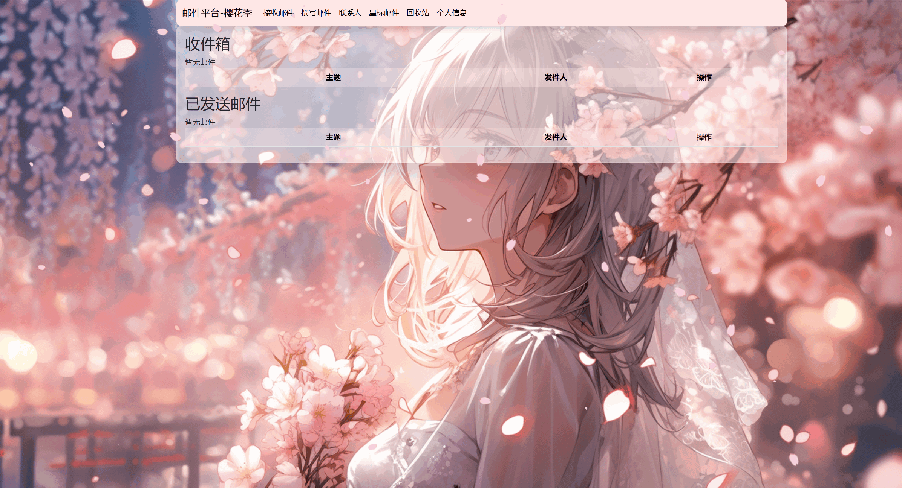

# MailSystem



## 1. 填写邮箱信息

复制项目根目录的 `.env.example`，将副本改名为 `.env`，然后在 `.env` 中填写邮箱账号和授权码：

```ini
DJANGO_SECRET_KEY=任意较长的随机字符串
EMAIL_BACKEND=django.core.mail.backends.smtp.EmailBackend
EMAIL_HOST=smtp.qq.com
EMAIL_PORT=465
EMAIL_USE_SSL=true
EMAIL_USE_TLS=false
EMAIL_HOST_USER=你的QQ邮箱地址
EMAIL_HOST_PASSWORD=你的QQ邮箱授权码
```

`EMAIL_HOST_PASSWORD` 填写 QQ 邮箱授权码，不是 QQ 登录密码。请先在 QQ 邮箱设置中启用 SMTP 和 IMAP 服务并生成授权码。

## 2. 安装并运行

在项目根目录打开 PowerShell，依次执行：

```powershell
python -m venv .venv
.\.venv\Scripts\Activate.ps1
python -m pip install -r requirements.txt
python manage.py migrate
python manage.py runserver
```

如果 PowerShell 不允许激活虚拟环境，直接执行：

```powershell
.\.venv\Scripts\python.exe -m pip install -r requirements.txt
.\.venv\Scripts\python.exe manage.py migrate
.\.venv\Scripts\python.exe manage.py runserver
```

## 3. 访问网站

启动成功后，在浏览器打开：

<http://127.0.0.1:8000/>
